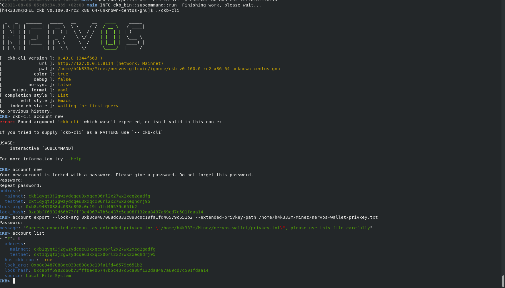
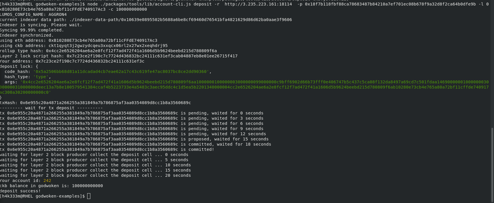

Task 1
===
1. A screenshot of the accounts you created (account list) in ckb-cli.

2. A link to the Layer 1 address you funded on the Testnet Explorer:

[ckt1qyqt3j2gwzydcqeu3xxqcx06rl2x27wx2xeqhdrj95](https://explorer.nervos.org/aggron/address/ckt1qyqt3j2gwzydcqeu3xxqcx06rl2x27wx2xeqhdrj95)

3. A screenshot of the console output immediately after you have successfully submitted a deposit to Layer 2.

