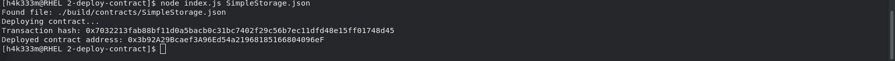

Task 1
===
1. A screenshot of the console output immediately after you have successfully deployed a smart contract:

2. The transaction hash from the contract deployment (in text format):

0x7032213fab88bf11d0a5bacb0c31bc7402f29c56b7ec11dfd48e15ff01748d45

3. The deployed contract address from the contract deployment (in text format):

0x3b92A29Bcaef3A96Ed54a21968185166804096eF
