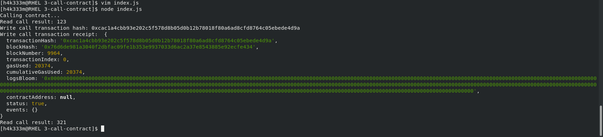

# Task 3
1. A screenshot of the console output immediately after you have successfully issued a smart contract call.


2. The transaction hash from the console output (in text format).

```
0xcac1a4cbb93e202c5f578d8b05d0b12b78018f80a6ad8cfd8764c05ebede4d9a
```
3. The contract address that you called (in text format).

```
0x3b92A29Bcaef3A96Ed54a21968185166804096eF
```
4. The ABI for contract you made a call on (in text format).
```
[
    {
      "inputs": [],
      "stateMutability": "payable",
      "type": "constructor"
    },
    {
      "inputs": [
        {
          "internalType": "uint256",
          "name": "x",
          "type": "uint256"
        }
      ],
      "name": "set",
      "outputs": [],
      "stateMutability": "payable",
      "type": "function"
    },
    {
      "inputs": [],
      "name": "get",
      "outputs": [
        {
          "internalType": "uint256",
          "name": "",
          "type": "uint256"
        }
      ],
      "stateMutability": "view",
      "type": "function"
    }
 ]
```
