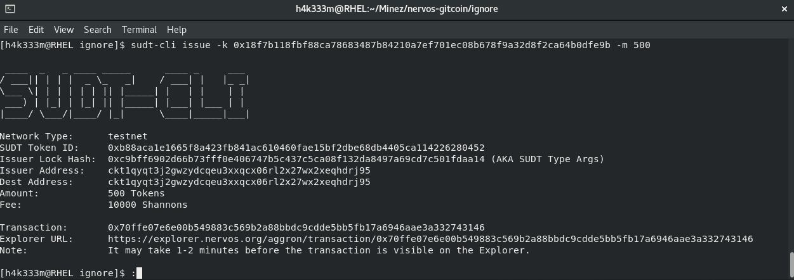
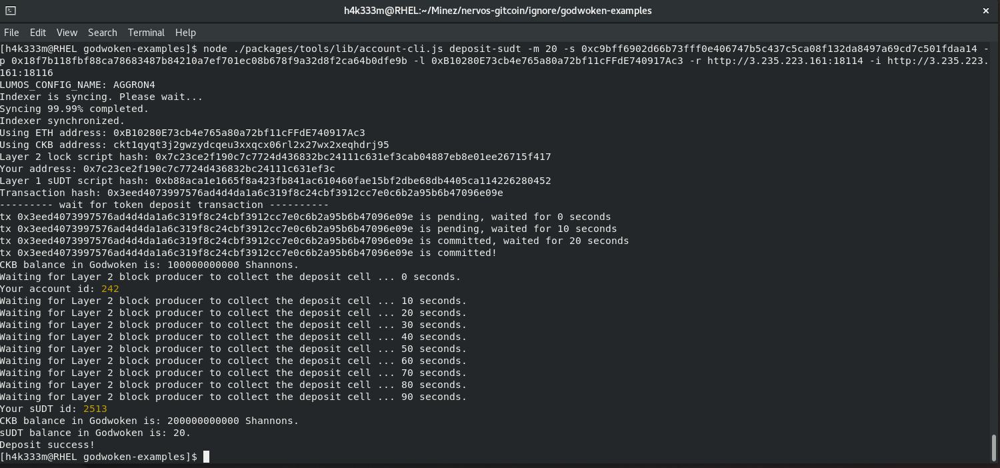

## 1. A link to the Layer 1 address you funded on the Testnet Explorer.
https://explorer.nervos.org/aggron/address/ckt1qyqt3j2gwzydcqeu3xxqcx06rl2x27wx2xeqhdrj95
## 2. A screenshot of the console output immediately after using sudt-cli to create your SUDT tokens on Layer 1.

## 3. A link to the transaction ID created by sudt-cli on the Testnet Explorer.
https://explorer.nervos.org/aggron/transaction/0x70ffe07e6e00b549883c569b2a88bbdc9cdde5bb5fb17a6946aae3a332743146

## 4. A screenshot of the console output immediately after you have successfully submitted a deposit to Layer 2 using the account-cli tool.

## 5. The SUDT ID from the console output after executing the deposit script (in text format).

2513
